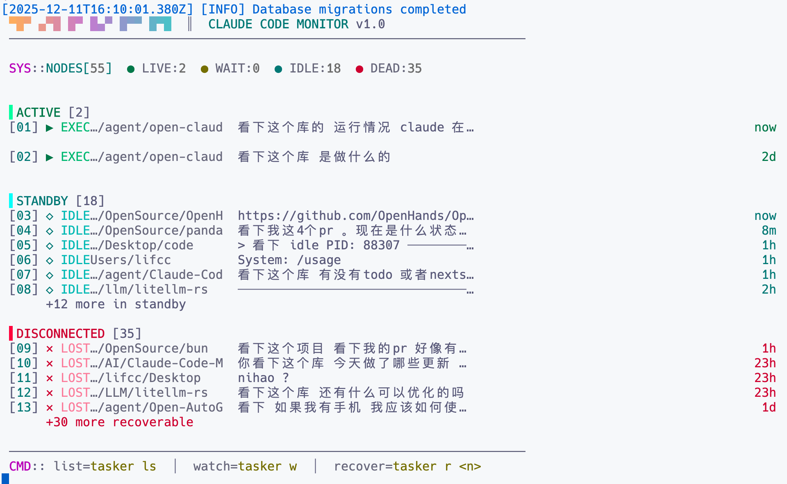

<div align="center">

# Tasker

**Claude Code Session Monitor & Recovery Tool**

[](LICENSE)
[](https://bun.sh)
[](https://www.typescriptlang.org/)

</div>

---

## What is Tasker?

Tasker monitors all your Claude Code sessions across your system. It tracks session status in real-time, calculates token usage and costs, and can recover lost sessions when terminals crash.

**Key capabilities:**
- Real-time monitoring of all Claude Code sessions
- Token counting and cost calculation (supports cache tokens)
- One-command session recovery
- Web dashboard with multiple themes
- Background daemon for continuous monitoring

---

## Screenshots

### Terminal UI



### Web Dashboard

| Sessions | Projects | Analytics |
|:--------:|:--------:|:---------:|
|  |  |  |

---

## Quick Start

```bash
# Clone and install
git clone https://github.com/majiayu000/Claude-Code-Monitor.git
cd Claude-Code-Monitor
bun install

# Build
bun run build

# Start web UI
bun run start web
```

Open **http://localhost:3377**

---

## CLI Commands

```bash
tasker                        # List all sessions (default)
tasker list                   # List with filters
tasker watch                  # Live monitor mode
tasker recover <session-id>   # Recover a lost session
tasker web                    # Start web UI (port 3377)
tasker daemon start           # Run as background service
tasker hooks install          # Install Claude hooks for real-time updates
tasker sync                   # Manual session sync
```

### List Options

```bash
tasker list -s running        # Filter by status (running/waiting/idle/lost/completed)
tasker list -d /path/to/dir   # Filter by directory
tasker list --style cyber     # UI style (cyber/minimal/dashboard/neon/macos)
```

### Recovery Options

```bash
tasker recover <id>           # Recover with auto-detected method
tasker recover <id> -m resume # Resume from saved session
tasker recover <id> -t        # Open in new terminal window
```

---

## Session States

| Status | Description |
|--------|-------------|
| `running` | Active process with recent activity |
| `waiting` | Process waiting for user input |
| `idle` | Process alive but inactive |
| `lost` | Process terminated (recoverable) |
| `completed` | Session finished normally |

---

## Features

### Token & Cost Tracking

- Real-time token counting from Claude JSONL files
- Cache token support (creation at 1.25x, read at 0.1x cost)
- Multi-model pricing (Claude 3.x, 4.x, Opus, Sonnet, Haiku)
- Per-session and aggregate statistics

### Tool Visibility

- Track which tools Claude is using
- View tool call history with timestamps
- See current file being edited
- Input/output inspection

### Session Recovery

Recovers sessions when terminals crash:
- **resume**: Restore from saved session ID (preserves full context)
- **continue**: Continue in same directory (new session)
- **new**: Create new session with original prompt

### Real-time Hooks

Install hooks for instant updates:

```bash
tasker hooks install
```

This integrates with Claude Code to send events on every tool use.

### Background Daemon

```bash
tasker daemon start --hooks   # Start daemon with hooks
tasker daemon status          # Check daemon status
tasker daemon stop            # Stop daemon
```

The daemon continuously scans for Claude processes and syncs session data.

---

## Web API

| Endpoint | Method | Description |
|----------|--------|-------------|
| `/api/sessions` | GET | List sessions with pagination |
| `/api/sessions/:id` | GET | Get session details |
| `/api/sessions/:id/tools` | GET | Tool call history |
| `/api/sessions/:id/subagents` | GET | Sub-agent sessions |
| `/api/sessions/:id/recover` | POST | Recover session |
| `/api/sessions/:id/stop` | POST | Stop session |
| `/api/sync` | POST | Trigger sync |
| `/api/quota` | GET | Anthropic quota usage |
| `/api/usage` | GET | Token usage stats |

WebSocket endpoint at `/api/ws` for real-time updates.

---

## Keyboard Shortcuts (Web UI)

| Key | Action |
|-----|--------|
| `r` | Refresh sessions |
| `s` | Sync from Claude |
| `/` | Focus search |
| `t` | Cycle theme |
| `1-5` | Switch theme directly |
| `?` | Show help |

**Themes:** Cyberpunk, Matrix, Synthwave, Minimal, Tokyo

---

## Configuration

Data stored in `~/.tasker/`:

```
~/.tasker/
├── tasker.db       # SQLite database
├── config.json     # Configuration
├── tasker.pid      # Daemon PID
└── logs/           # Log files
```

### Config Options

```json
{
  "scanInterval": 5000,
  "hookPort": 7890,
  "logLevel": "info",
  "retentionDays": 30,
  "activeCpuThreshold": 1.0,
  "idleThresholdSeconds": 30
}
```

---

## Architecture

```
┌─────────────────────────────────────────────────────────────────┐
│                         TASKER                                  │
├─────────────┬─────────────┬─────────────┬─────────────┬────────┤
│   CLI UI    │   Web UI    │   Daemon    │   Hooks     │  API   │
│   (Ink)     │  (React)    │ (Background)│  (HTTP)     │ (Hono) │
├─────────────┴─────────────┴─────────────┴─────────────┴────────┤
│                      Session Service                            │
├─────────────┬─────────────┬─────────────┬──────────────────────┤
│  Process    │   Claude    │   Storage   │   Recovery           │
│  Scanner    │   Parser    │  (SQLite)   │   Engine             │
└─────────────┴─────────────┴─────────────┴──────────────────────┘
```

**Tech Stack:**
- Runtime: [Bun](https://bun.sh)
- CLI: [Commander.js](https://github.com/tj/commander.js) + [Ink](https://github.com/vadimdemedes/ink)
- Web: [Hono](https://hono.dev) + [React](https://react.dev) + [Vite](https://vitejs.dev)
- Database: SQLite (Bun native)

---

## Development

```bash
bun run dev          # Development mode
bun run typecheck    # Type checking
bun test             # Run tests
bun run build        # Production build
```

---

## License

MIT © 2025

</div>
