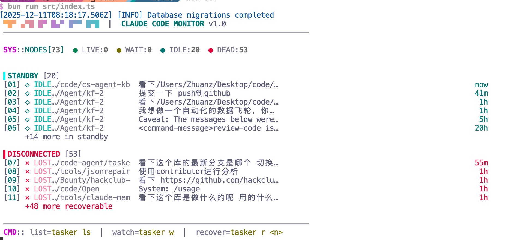
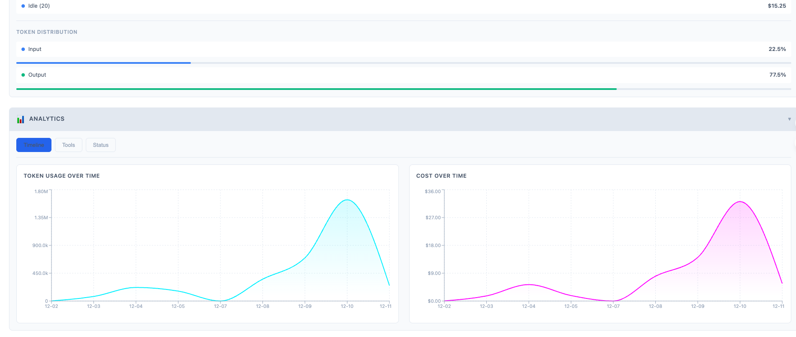
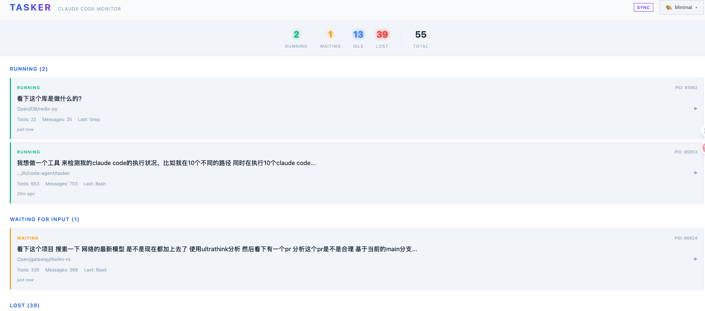

<div align="center">


# Claude Hub

### 再也不会丢失你的 Claude Code 工作了

**Claude Code 重度用户的控制中心**

[](https://www.npmjs.com/package/claude-hub)
[](https://www.npmjs.com/package/claude-hub)
[](https://github.com/majiayu000/claude-hub)
[](LICENSE)

[English](README.md) | 中文

[快速开始](#-快速开始) | [功能特性](#-功能特性) | [截图](#-截图) | [文档](#-文档)

<br />


</div>

---

## 痛点

你正在用 Claude Code 愉快地写代码，一切都很顺利。然后...

- **终端崩溃** — 几小时的上下文，没了
- **多个会话** — 哪个在处理认证的 bug 来着？
- **费用焦虑** — "今天花了多少钱？"
- **进度丢失** — "午饭前我在做什么来着？"

## 解决方案

**Claude Hub** 实时监控所有 Claude Code 会话，自动恢复崩溃的会话，追踪费用，并在会话间保持上下文。

```bash
bunx claude-hub
```

就这么简单。打开 `http://127.0.0.1:3377` 开始掌控。

---

## 为什么选择 Claude Hub？

|  | 没有 Claude Hub | 有 Claude Hub |
|--|-----------------|---------------|
| **终端崩溃** | 丢失所有上下文，从头开始 | 一键恢复，完整上下文 |
| **多个会话** | 切换终端，容易搞混 | 所有会话一个仪表板 |
| **费用追踪** | 手动查 Anthropic 控制台 | 实时费用 + 预测 |
| **会话上下文** | 关掉终端就没了 | 持久化，可搜索 |
| **项目概览** | 散落在各个目录 | 按项目聚合 |

## 仓库范围

当前这个仓库只保留 Claude Hub 主应用，以及仓库内的 `menubar-tauri` 配套目录。

之前混在这里的实验 runner 工作区已经迁移到同级目录 `../Claude-Code-Monitor-extracted/`，不再属于这个仓库的构建和测试范围。

---

## 快速开始

### 方式一：bunx（推荐）

```bash
bunx claude-hub
```

需要先安装 Bun 1.1+。

### 方式二：全局安装

```bash
bun install -g claude-hub
claude-hub web
```

### 方式三：从源码

```bash
git clone https://github.com/majiayu000/claude-hub.git
cd claude-hub
bun install && bun run build
bun run start web
```

打开 **http://127.0.0.1:3377**

默认只绑定本机回环地址；如果你确实要对外暴露，再设置 `CLAUDE_HUB_HOST`。

---

## 功能特性

### 实时会话监控

监控系统上所有 Claude Code 实例。状态、当前文件、最后工具、活跃度一目了然。

```
┌─────────────────────────────────────────────────────────────────┐
│ 会话列表                                            3 个活跃    │
├─────────────────────────────────────────────────────────────────┤
│ ● 运行中   my-app          编辑: src/auth.ts      2秒前       │
│ ● 等待中   api-service     读取: README.md        5分钟前     │
│ ○ 空闲     docs            写入: guide.md        15分钟前     │
│ ✗ 丢失     old-project     —                      2小时前     │
└─────────────────────────────────────────────────────────────────┘
```

### 一键会话恢复

终端崩溃？会话丢失？几秒钟恢复，完整上下文。

```bash
claude-hub recover <session-id>
```

三种恢复方式：
- **Resume（恢复）** — 恢复精确的会话状态（推荐）
- **Continue（继续）** — 在同一目录新建会话
- **New（新建）** — 用原始 prompt 全新开始

### 费用分析与预测

实时追踪花费。精确知道 token 花在哪里。

```
┌─────────────────────────────────────────────────────────────────┐
│ 费用分析                                                        │
├─────────────────────────────────────────────────────────────────┤
│ 今日          $12.34  ▲ 23%                                     │
│ 本周          $67.89                                            │
│ 本月         $198.50  (预计: $320)                              │
│                                                                 │
│ 缓存节省      $45.20  (占总量 38%)                              │
│ 命中率: 72%                                                     │
└─────────────────────────────────────────────────────────────────┘
```

特性：
- 按会话费用明细
- 缓存 token 追踪（创建 1.25x，读取 0.1x）
- 多模型支持（Opus、Sonnet、Haiku）
- 日/周/月趋势

### 跨会话记忆

Claude Hub 实现了"接力赛"模式 — 你的进度在会话间持久保存。

```
┌─────────────────────────────────────────────────────────────────┐
│ 会话记忆                                    my-app              │
├─────────────────────────────────────────────────────────────────┤
│ 最新进度: 实现了 OAuth2 登录流程                                │
│                                                                 │
│ 已完成:                                                         │
│   ✓ 数据库 schema 设计                                          │
│   ✓ User 模型 + bcrypt                                          │
│   ✓ JWT token 生成                                              │
│                                                                 │
│ 待完成:                                                         │
│   ○ Refresh token 轮换                                          │
│   ○ 密码重置流程                                                │
│                                                                 │
│ 已知问题:                                                       │
│   ! 中间件未处理 token 过期                                     │
└─────────────────────────────────────────────────────────────────┘
```

恢复会话时，这些上下文会自动注入。

### Plans 追踪

追踪 Claude 的实施计划。查看阶段、任务和完成率。

```
┌─────────────────────────────────────────────────────────────────┐
│ 计划列表                                                        │
├─────────────────────────────────────────────────────────────────┤
│ Auth 系统重构                                     ████████░░ 80% │
│   Phase 1: 数据库 Schema                          ✓ 已完成      │
│   Phase 2: API 端点                               ✓ 已完成      │
│   Phase 3: 前端集成                               ● 进行中      │
│   Phase 4: 测试                                   ○ 待开始      │
└─────────────────────────────────────────────────────────────────┘
```

### Web 仪表板

漂亮的赛博朋克主题仪表板，5 种配色方案。

| 会话 | 分析 | 项目 |
|:----:|:----:|:----:|
|  |  |  |

**快捷键：**
- `r` — 刷新会话
- `s` — 从 Claude 同步
- `/` — 聚焦搜索
- `t` — 切换主题
- `?` — 显示帮助

**主题：** Cyberpunk、Matrix、Synthwave、Minimal、Tokyo

---

## CLI 命令

```bash
# 核心命令
claude-hub                      # 启动 Web 仪表板（默认）
claude-hub list                 # 列出所有会话
claude-hub watch                # 终端实时监控
claude-hub recover <id>         # 恢复丢失的会话

# 会话管理
claude-hub list -s running      # 按状态过滤
claude-hub list -d ./my-app     # 按目录过滤

# 记忆管理
claude-hub memory list          # 列出会话记忆
claude-hub memory show <id>     # 显示记忆详情
claude-hub memory export <id>   # 导出恢复上下文

# 后台服务
claude-hub daemon start         # 启动后台监控
claude-hub daemon stop          # 停止守护进程
claude-hub hooks install        # 安装 Claude hooks
```

---

## 对比

| 功能 | 手动 | claude-mem | **Claude Hub** |
|------|:----:|:----------:|:--------------:|
| 多会话监控 | - | - | **支持** |
| 会话恢复 | - | - | **3 种方式** |
| 费用追踪 | - | - | **支持 + 预测** |
| 缓存 token 分析 | - | - | **支持** |
| 跨会话记忆 | - | 支持 | **支持** |
| Web 仪表板 | - | 基础 | **5 种主题** |
| Plans 追踪 | - | - | **支持** |
| 实时 hooks | - | 支持 | **支持** |
| 后台守护进程 | - | - | **支持** |
| Sub-agent 追踪 | - | - | **支持** |

---

## 配置

数据存储在 `~/.claude-hub/`：

```
~/.claude-hub/
├── claude-hub.db    # SQLite 数据库
├── config.json      # 配置文件
└── claude-hub.log   # 日志文件
```

---

## 开发

```bash
bun run dev          # 开发模式
bun run typecheck    # 类型检查
bun test             # 运行测试
```

---

## 路线图

- [ ] 费用告警和预算
- [ ] 团队仪表板
- [ ] Cursor/Copilot 支持
- [ ] 会话回放/时间线
- [ ] 插件系统

---

<div align="center">

**为 Claude Code 重度用户打造**

MIT License

</div>
